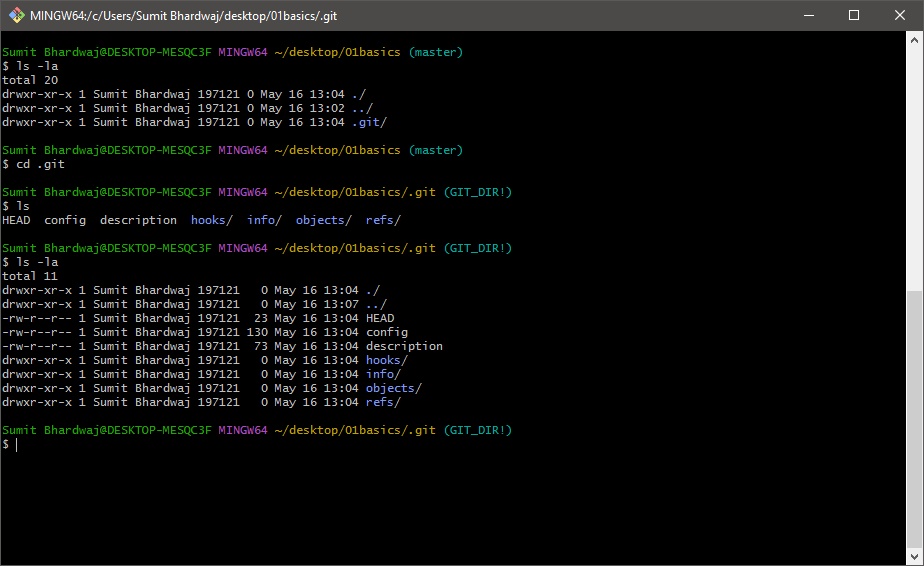

# Why Git?
  Version Control -
  Software revert is more than ```ctrl + z``` 
#### VCS ```v/s``` SCM
#### Past ```-``` CVS, SVN

# Git 
  2005 - By Linus Torvalds
  ```Open Source and Free```
#### Availabel for Mac, Linux and Windows
#### Github ```hosts``` your repositories
#### But Repo can be hosted on other place too
#### No Single Point of failure
#### Forking is encouraged
#### Go your own way - Example ```MariaDB```
***
## Collaboration 
#### Every user maintains their own repos
#### Git tracks Changes
#### Merge the Changes - ```G1, G2, G3, G4, G5```
***
# Git Architecture
  
***
#### When we initialize git in our project the git track through the root folder and that is whole meat part of it.
#### When we do ```ls -la``` we get a .git/ file 
#### When we do ```ls -la``` in that we get whole lot of things that is root and that is whole meat part of it.
***


#### This contains some important directories ```HEAD```, ```config ```and ```refs```. Now You Should not enter into these. These can create mess in your project.
***
#### You Should keep in mind ```git help``` command. It comes very handy. 
#### First we should make all those files ready by ```git add . ```
#### This ```.``` simply means all files if you want to add individually you can specify the name of file and add that ```git add 01basics.txt```
#### Doing this all so files comes into staging area and ready for commit.
#### When Doing Commit message should be expressive. ```git commit -m "initial commit" ```
#### After Doing ```git commit ``` we can do ```git log ``` and its very important. It gives us a long ```SHA String ``` which is important for tracking our project.
***
```
commit cfb14deca0a75e836fe972e961cd94e69612b20a (HEAD -> master)
Author: Sumit Bhardwaj <sumitbhardwaj106@gmail.com>
Date:   Tue May 16 13:39:58 2023 +0530
```
#### This Notes author and time. This help in getting know who had made commit

#### Remember we have not pushed that file to repo that is still in our staging area if i am going to add something into that file even a dot it will be able to track that you can check that by simply ```git status```
***
 ``` 
  On branch master
  Changes not staged for commit:
  (use "git add <file>..." to update what will be committed)
  (use "git restore <file>..." to discard changes in working directory)
        modified:   01basics.txt

no changes added to commit (use "git add" and/or "git commit -a")

```
####  Your message should be discriptive so everyone can read that better
####  Everything Stores into log. The Commit . Commit has all the details about author and time who has made that comment. we can see our last commits by command ```git log -n 2``` where  ```n``` is the number of last commits we want to see
***
# Author 
#### Another important one is about author ```git log --author="Sumit Bhardwaj" ```
# For Time Frame
#### Another important one is Since and Until ```git log --since=date``` in since you need to give date since when you want to see commits ```git log --until=date```

### Now Come Back to that Long SHA
#### This Long SHA is very handy to move forwards and backwards into project because project goes way long and sometimes it can become messy by adding code or images whatever then you want to come backward where everything was working in that case its very useful.

# Git Snapshots(Time Travel)
- A Checksum is generated with data
- Data integrity is top priority
- 40 character SHA-1 ```[0-9 or a-f]```
#### Git takes all information into project ```files, commit messages, time, author ``` everything. That everything go into algorithm knowns as SHA-1. When you even add a dot into any of file of project. It generates a different SHA-1 or big string(40 Characters ). These are Known as Snap Shots

# Understanding HEAD and Checksum
#### When you open any notepad, you see cursor blinking. Assume that as ```HEAD```. Now I have added ```This is my first line``` into my file. Now Cursor must be blinking at `e` of `line` so ```HEAD``` is at `e`. Now wherever cursor blinks the ```HEAD``` is there even i add or delete from file. I Can go back and add something there then my ```HEAD``` will be there. So in general wherever the tip of latest commit my HEAD stay there. Sometimes in project we want to point our ```HEAD``` on previous commits and want to add there. That can be the case. That is all ```HEAD``` is made for. We should keep in my mind that where my HEAD is and where i am adding or making changes in my project. ```HEAD is your Cursor in layman terms.``` 

# Track difference b/w files
#### When we make changes in any file or someone else has made changes and we do not know the exact changes then we can do `git diff ` to know the changes but in large code bases it can be tricky too and this command has its some parameters also. we will see that further for now it is good that you become familiar with this.  

#### We can check difference b/w staged and local files by passing arguments `git diff --staged`
# Deleting From Repo
- Bad way to delete 
   - when file is in staged phase and we delete that directly from folder
- Better way to delete
#### ```git rm filename``` 

#### After deleting. This also needs to be commited so that everyone know what have you deleted

#### This all depends on perpective what you want to acheive. There is no such good or bad things. But working with others you must need to be careful

# Repo Reset and unstaging
- Situation 1
  - Suppose i am working in my local repo. i have made some changes into my file now that file has started not working properly. suppose its making issues in my project right. In this situation if i want previous version of my file where i commited that. i can do  ``` git checkout --filename``` and magically every changes will be gone and you will get previous version of your file where your file was working properly. This command comes in handy when we work with branches. we will see that later.
- Situation 2
  - Suppose i have accidently pushed a file into staged area. i want that back to local area. i can simply run a command for that file. also it can be done for whole lot of files ```git reset HEAD ``` it bring file to local or unstage area. Now i can do  ``` git checkout --filename``` if i want previous version of file or can keep working in local


