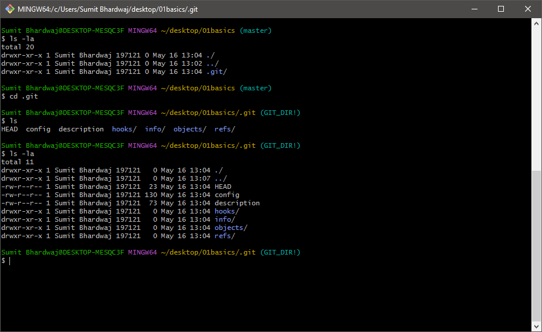

# Why Git?
  Version Control -
  Software revert is more than ```ctrl + z``` 
#### VCS ```v/s``` SCM
#### Past ```-``` CVS, SVN

# Git 
  2005 - By Linus Torvalds
  ```Open Source and Free```
#### Availabel for Mac, Linux and Windows
#### Github ```hosts``` your repositories
#### But Repo can be hosted on other place too
#### No Single Point of failure
#### Forking is encouraged
#### Go your own way - Example ```MariaDB```
***
## Collaboration 
#### Every user maintains their own repos
#### Git tracks Changes
#### Merge the Changes - ```G1, G2, G3, G4, G5```
***
# Git Architecture
  
***
#### When we initialize git in our project the git track through the root folder and that is whole meat part of it.
#### When we do ```ls -la``` we get a .git/ file 
#### When we do ```ls -la``` in that we get whole lot of things that is root and that is whole meat part of it.
***


#### This contains some important directories ```HEAD```, ```config ```and ```refs```. Now You Should not enter into these. These can create mess in your project.
***
#### You Should keep in mind ```git help``` command. It comes very handy. 
#### First we should make all those files ready by ```git add . ```
#### This ```.``` simply means all files if you want to add individually you can specify the name of file and add that ```git add 01basics.txt```
#### Doing this all so files comes into staging area and ready for commit.
#### When Doing Commit message should be expressive. ```git commit -m "initial commit" ```
#### After Doing ```git commit ``` we can do ```git log ``` and its very important. It gives us a long ```SHA String ``` which is important for tracking our project.
***
```
commit cfb14deca0a75e836fe972e961cd94e69612b20a (HEAD -> master)
Author: Sumit Bhardwaj <sumitbhardwaj106@gmail.com>
Date:   Tue May 16 13:39:58 2023 +0530
```
#### This Notes author and time. This help in getting know who had made commit

#### Remember we have not pushed that file to repo that is still in our staging area if i am going to add something into that file even a dot it will be able to track that you can check that by simply ```git status```
***
 ``` 
  On branch master
  Changes not staged for commit:
  (use "git add <file>..." to update what will be committed)
  (use "git restore <file>..." to discard changes in working directory)
        modified:   01basics.txt

no changes added to commit (use "git add" and/or "git commit -a")

```
####  Your message should be discriptive so everyone can read that better
####  Everything Stores into log. The Commit . Commit has all the details about author and time who has made that comment. we can see our last commits by command ```git log -n 2``` where  ```n``` is the number of last commits we want to see
***
# Author 
#### Another important one is about author ```git log --author="Sumit Bhardwaj" ```
# For Time Frame
#### Another important one is Since and Until ```git log --since=date``` in since you need to give date since when you want to see commits ```git log --until=date```

### Now Come Back to that Long SHA
#### This Long SHA is very handy to move forwards and backwards into project because project goes way long and sometimes it can become messy by adding code or images whatever then you want to come backward where everything was working in that case its very useful.

# Git Snapshots(Time Travel)
- A Checksum is generated with data
- Data integrity is top priority
- 40 character SHA-1 ```[0-9 or a-f]```
#### Git takes all information into project ```files, commit messages, time, author ``` everything. That everything go into algorithm knowns as SHA-1. When you even add a dot into any of file of project. It generates a different SHA-1 or big string(40 Characters ). These are Known as Snap Shots


# Understanding HEAD and Checksum
#### When you open any notepad, you see cursor blinking. Assume that as ```HEAD```. Now I have added ```This is my first line``` into my file. Now Cursor must be blinking at `e` of `line` so ```HEAD``` is at `e`. Now wherever cursor blinks the ```HEAD``` is there even i add or delete from file. I Can go back and add something there then my ```HEAD``` will be there. So in general wherever the tip of latest commit my HEAD stay there. Sometimes in project we want to point our ```HEAD``` on previous commits and want to add there. That can be the case. That is all ```HEAD``` is made for. We should keep in my mind that where my HEAD is and where i am adding or making changes in my project. ```HEAD is your Cursor in layman terms.``` 

# Track difference b/w files
#### When we make changes in any file or someone else has made changes and we do not know the exact changes then we can do `git diff ` to know the changes but in large code bases it can be tricky too and this command has its some parameters also. we will see that further for now it is good that you become familiar with this.  

#### We can check difference b/w staged and local files by passing arguments `git diff --staged`
# Deleting From Repo
- Bad way to delete 
   - when file is in staged phase and we delete that directly from folder
- Better way to delete
#### ```git rm filename``` 

#### After deleting. This also needs to be commited so that everyone know what have you deleted

#### This all depends on perpective what you want to acheive. There is no such good or bad things. But working with others you must need to be careful

# Repo Reset and unstaging
- Situation 1
  - Suppose i am working in my local repo. i have made some changes into my file now that file has started not working properly. suppose its making issues in my project right. In this situation if i want previous version of my file where i commited that. i can do  ``` git checkout --filename``` and magically every changes will be gone and you will get previous version of your file where your file was working properly. This command comes in handy when we work with branches. we will see that later.
- Situation 2
  - Suppose i have accidently pushed a file into staged area. i want that back to local area. i can simply run a command for that file. also it can be done for whole lot of files ```git reset HEAD ``` it bring file to local or unstage area. Now i can do  ``` git checkout --filename``` if i want previous version of file or can keep working in local

# Can we Reset Commits?
#### No, You Can not Make Changes into commit but here is an exception. Answer of this comes from Git Fundamentals. Git has basically designed upon two principles Data Integrity and revisioning. Once the data is there if you are changing that a new ```SHA``` will be generated. This SHA keeps Data integrity intact. But Exception comes from a very last commit. You can change that or edit latest commit. in git we say that ```amend``` the commit. ``` git commit --amend -m ' this is new message '```

# Checkout with previous version 
#### suppose you have a file you want to go back on to previous version of that file. you can simply do ```git log``` all SHA that have generated will pop up. you can figure out where your file was working fine after that you can copy that SHA (only few starting alphabets will work) ```git checkout SHA filename```. You can review it before doing so ```git diff --unstage filename``` it will show what you are about to lose. After confirming you can ``` git reset HEAD filename``` reset the HEAD for file

# Soft(Safe), Mixed(Default) and Hard(Caution) Reset
### Reset Means You about to lost data.

### Soft Just Points towards another SHA. SHA Points on the tip of branch. When we do Soft delete it wont affect staging area and local files. just i need to git log and take SHA from where i want to start or record again. i just need to pass that SHA

### Mixed - Points towards another SHA and makes your staging area a copy of repo. it wont affect local

### Hard - Its Includes - Local Files, Staging Area and Repo.
### You can read more on this

# Ignoring The Files (Git do not track these files)
### There is command git clean that clean the files from local itself but it wont work upon staged and repo area. It is not so much good
### another powerful alternate we have ```.gitignore```. This wont listen we just need to make a file in which we need to include that what should be ignored for going into staged and repo area.
### In a case if we want to ignore all the files of some specific extension like .js then we can do something like this ```*.js``` this will ignore all the file of ```.js``` extension but what if we want to keep single file of ```.js``` extension then we simply can put negate sign ```!app.js``` doing so only this file with extension ```.js```will go to repo. Rest all will be ignored

# What to Ignore 
### We should ignore all the Bulky files and executable files that can be execute with code itself like dist files into parcel can be made as many times you want with simple command.

# Notice ! .gitignore file need to go into repo. 

# Gitignore will not listen
### Suppose You have commited one file later you realized it should have into ```.gitignore```. In that case what you can do - delete the file and make other then put that into ```.gitignore```. But Here is another solution that we can put a query ```git rm --cached filename```. This will remove that file from staged area.
---
# This is does not even in git docs.
### This is a trick. By default git does not care about empty folder. But what we can do is we can have a file with ```.gitkeep``` inside that or some other name - name does not matter - dot matters here - file should start with dot. By doing so git will start tracking empty folder too

# Git tree listing
### ls-tree
### List the Contents of a given tree object like what ```ls -la``` does in the current working directory - Full SHA-1 - Partial SHA-1 - Branch Reference - Tag Reference - ^ - ~
```git ls-tree Head```
``` git ls-tree master```

# Git log 
### This is useful for team lead to know about team members who all are commiting  
```git log --oneline``` it brings all commit into one line. we can pass number so that only required commit come 
```git log since='date'``` also its for --until 
```git log --author="name"```
Next is ``` git log --grep='ignoring' ``` it will search between those commited which contains ignoring word
You can mention range of SHA-1 it will give all commit between those SHA-1. its more like filter
```git log --format=fuller``` and we have short too. it is for email too. its for graph too. I Highly recommend you to go into documentation for graph to understand it more precisely

# Branching
### try new ideas
### collaboration
### Merging
### context switching


Head can be tricky in this case but Head always points onto tip of the current working branch.

# creating a new branch 
### ```git branch branchName ```. ``` ls -la .git/refs/heads```
always use regular letter not any special character those are nightmares

## Git Checkout
### ``` git checkout branchName ``` by this command current working branch will change to mentioned branch
To commit ``` git commit -am 'msg' ```

``` git checkout -b branchName``` although we were using only checkout for changing the branch but this one can create new branch and change the current working branch with same

``` git log --graph --oneline --decorate ``` this can give track of all branch commits. it is very handy to keep track all of your teams

And

``` git checkout -- filename``` also clear your changes you have made to your branch filename. it will make it same as it is in master branch

# Renaming and Deleting of the branches 
### ```git diff  branchName..otherBranchName``` to have a difference b/w both branches
# To Rename a branch the command is 
``` git branch -m currentName newName ```

# To delete a Branch 
### First you need to switch yourself onto other branch or onto master. Then you need to pass a cmd ``` git branch -d branchName```. If this branch is not equivalent to master branch then git wont allow you to delete it. in this situation if you really wanna delete the branch then you need to yell at git means you need to pass ```-d``` in Caps ```-D```

# Merging in Git 
### First You need to be on reciver branch then you need to pull that branch. Command is simple ``` git branch branchName ```

# Fast-Forward Merging 
### When we make a new branch, work there and commit there. That make SHAs with commits. Now Master branch has different SHA on tip and this new branch has different SHA. In that case when we merge that branch to other branch the SHA of branch also integrate with receiving branch SHAs

### Another Scenario is When we do fast-forward the commit does not make any noise it just get merge with master branch but if you really wanna tell that you have worked on another branch and added a functionality then you commit that merge also. Yes it will make a new SHA the cmd is simple ``` git merge --no-ff branchName ``` --no-ff means is No Fast Forward

### Another scenario is if you only want to do fast-forward then cmd is simple ``` git merge --ff-only branchName ```. It will only do ff if it wont able to do that it will simply abort the operation

# Conflicts and Merging in Git
### Branching is tough in Git. When More than one developer in different branch work upon common file. On merging those Conflicts happen. Git won't understand what to do

### In this Situation You can not go back. You have three options here.
### 1. Simply Abort (Undo) the merge and get back.
### 2. Manually Resolve 
### 3. Use the Tools

### Modified file will look like this

### Manually You can delete the code between # and >>

### ``` git merge --abort ``` This will do Undo

# Stashing (Its like a folder)
### When you have added some functionality through a branch and now you want to go on another branch. In this case git asked you to commit these changes to branch so in this case suppose we still not sure about functionality and want to go on another branch without commiting that. In this case Stashing comes handy.
### Command is Simple ``` git stash save "message" ```

# Stashing in Multiple Branches
### To List out all stashes ``` git stash list ```
### To get a Particular stash because there can be a lot of stash on various branches on a bigger project ``` git stash show stash@{number of stash start from zero same like array } ```
### You can merge all of your stashes


